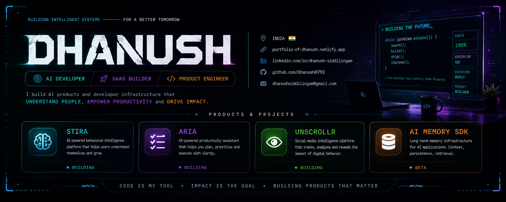

<p align="center">
  
</p>

<div align="center">

```text
██████╗ ██╗  ██╗ █████╗ ███╗   ██╗██╗   ██╗███████╗██╗  ██╗
██╔══██╗██║  ██║██╔══██╗████╗  ██║██║   ██║██╔════╝██║  ██║
██║  ██║███████║███████║██╔██╗ ██║██║   ██║███████╗███████║
██║  ██║██╔══██║██╔══██║██║╚██╗██║██║   ██║╚════██║██╔══██║
██████╔╝██║  ██║██║  ██║██║ ╚████║╚██████╔╝███████║██║  ██║
╚═════╝ ╚═╝  ╚═╝╚═╝  ╚═╝╚═╝  ╚═══╝ ╚═════╝ ╚══════╝╚═╝  ╚═╝
```

# Dhanush

### AI Products • SaaS Builder • Behavioral Intelligence

`Tirupati, India` • [Portfolio](https://portfolio-of-dhanush.netlify.app) • [LinkedIn](https://linkedin.com/in/dhanush-siddilingam)

</div>

---

## / about

I build AI-powered products focused on human behavior, productivity, attention, and decision-making.

Currently building:

- **STIRA** — Behavioral Intelligence Platform
- **ARIA** — AI Productivity Assistant
- **UNSCROLLR** — Social Media Intelligence Platform
- **AI Memory SDK** — Long-Term Memory Infrastructure for AI

My goal is to build software products used by millions of people worldwide.

---

## / ecosystem

<table>
<tr>

<td width="25%" valign="top">

### STIRA

**Behavioral Intelligence**

AI-powered platform that helps users understand and improve their habits, decisions, communication patterns, and personal growth.

</td>

<td width="25%" valign="top">

### ARIA

**Productivity Assistant**

AI-powered assistant that helps users plan, prioritize, organize, and execute tasks more effectively through intelligent automation.

</td>

<td width="25%" valign="top">

### UNSCROLLR

**Social Media Intelligence**

Analyzes digital behavior, attention patterns, and social media consumption to help users make healthier online decisions.

</td>

<td width="25%" valign="top">

### AI Memory SDK

**AI Infrastructure**

Long-term memory infrastructure that enables AI applications to remember users, preferences, facts, and interactions.

</td>

</tr>
</table>

---

## / tech stack

<p align="center">

</p>

---

## / github analytics

<div align="center">


</div>

<div align="center">


</div>

---

## / mission log

```text
[2024] Started taking software engineering seriously

[2025] Built AI automation tools and ML projects

[2026] Building STIRA, ARIA, UNSCROLLR, and AI Memory SDK

[2027] Scaling products

[????] Building globally-used software companies
```

---

## / connect

```text
Portfolio  → portfolio-of-dhanush.netlify.app

LinkedIn   → linkedin.com/in/dhanush-siddilingam

GitHub     → github.com/Dhanush0792

Email      → dhanushsiddilingam@gmail.com
```

---

<div align="center">

### Learn. Build. Ship. Repeat.


</div>

---

## / contribution activity

<div align="center">


</div>
